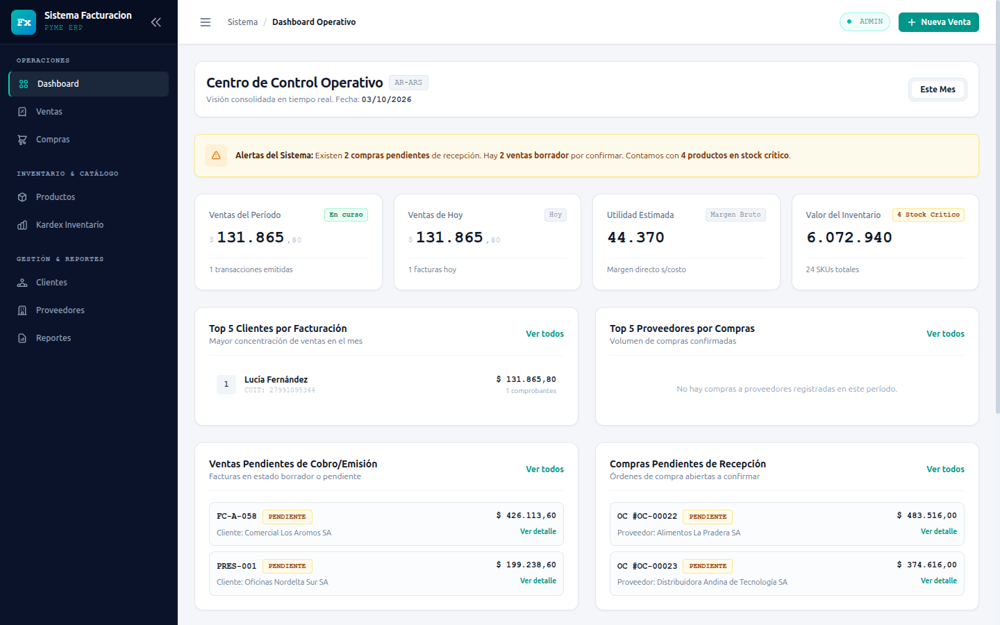
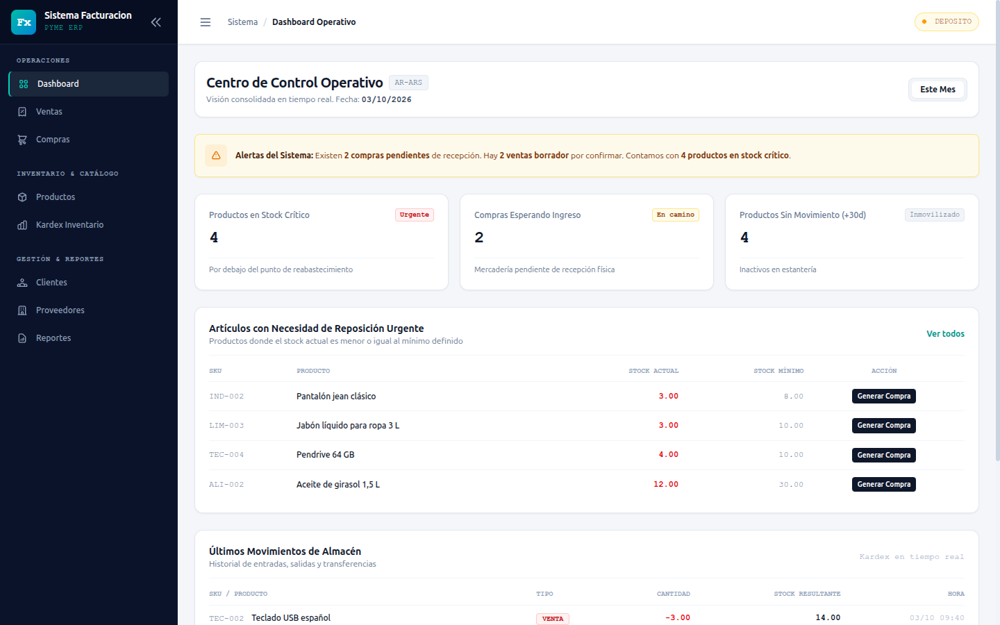
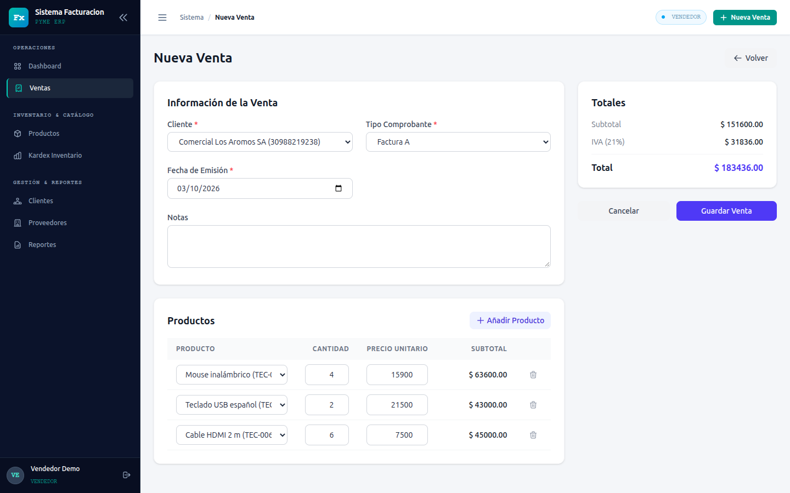
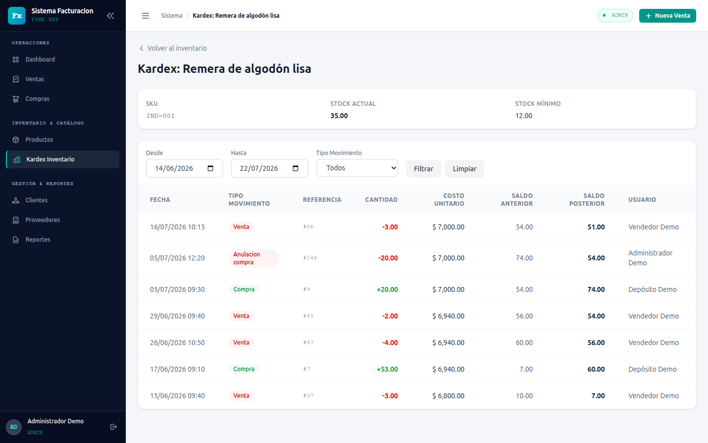
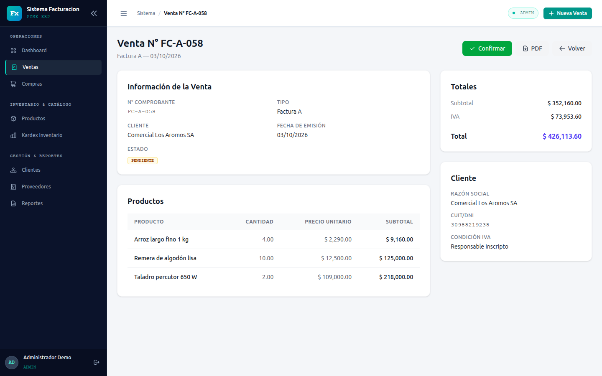
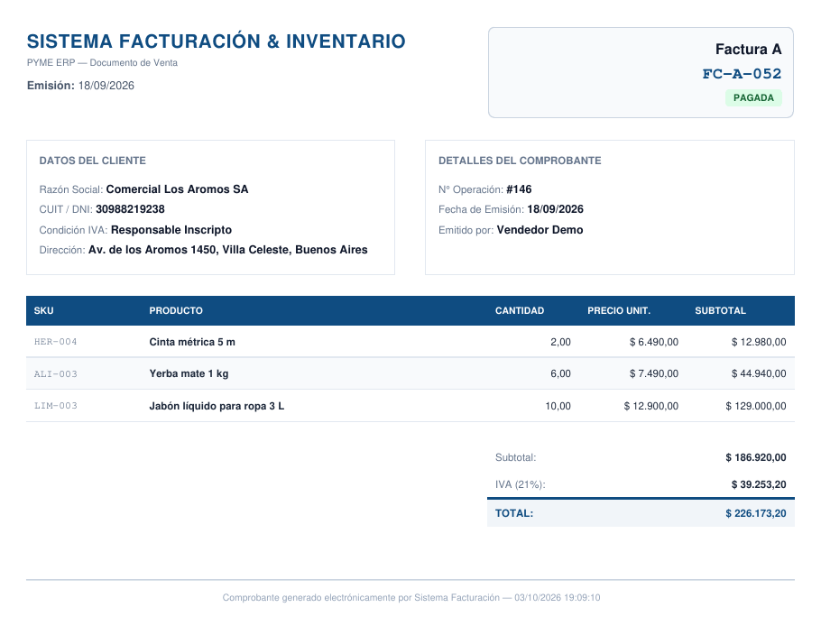
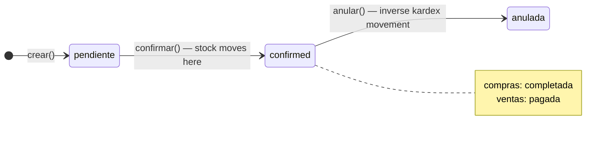
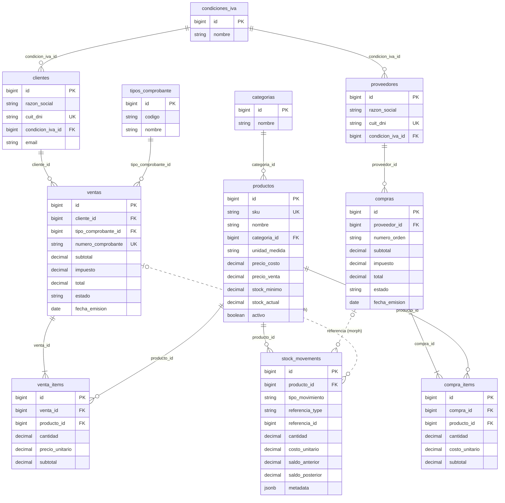

# Billing & Inventory Management System

**Billing & Inventory Management System for SMBs — Laravel 12 + PostgreSQL**

[](https://www.php.net/)
[](https://laravel.com/)
[](https://www.postgresql.org/)
[](https://github.com/dpedraza/billing-inventory-laravel/actions/workflows/tests.yml)
[](LICENSE)

A server-rendered web application for small and medium Argentine businesses: products, customers and suppliers, purchases and sales with VAT, transactional stock control with a full kardex, a role-specific dashboard and PDF/Excel reports.

> The UI, database schema and domain vocabulary are in Spanish (the target market is Argentina); code, classes and this README are in English.
> 🇦🇷 [Leer en español](docs/README.es.md)

---

## Screenshots

| Admin dashboard | Warehouse dashboard |
|---|---|
|  |  |
| **New sale (dynamic items)** | **Stock kardex** |
|  |  |
| **Sale detail (confirm / void)** | **Sale invoice PDF** |
|  |  |

---

## Features

**Products**
- CRUD with unique SKU, category, unit of measure, cost/sale price and minimum stock.
- Low-stock listing and per-product kardex.
- Stock entered on the product form (initial stock or a physical count) is recorded in the kardex as an adjustment, never written directly.

**Customers & Suppliers**
- CRUD with unique CUIT/DNI and VAT condition (Responsable Inscripto, Monotributista, Exento, Consumidor Final…).

**Purchases**
- Purchase orders with dynamic item rows (Alpine.js) and automatic 21 % VAT.
- Lifecycle: pending → completed → voided. Confirming adds stock and updates the product cost price.
- Printable purchase order (PDF).

**Sales**
- Sequential numbering per document type (`FC-A-001`, `FC-B-001`, `REM-…`, `PRES-…`).
- Lifecycle: pending → paid → voided. Confirming deducts stock and is rejected if stock is insufficient.
- Printable sales document (PDF).

**Inventory / Kardex**
- Every stock change (purchase, sale, void or manual adjustment) goes through `StockService` and is recorded in `stock_movements` with balance before/after, unit cost, user and JSONB metadata.
- Voiding a document writes the inverse movement instead of deleting history.

**Dashboard per role**
- **Admin:** period and today sales, estimated margin, inventory valuation, top 5 customers/suppliers, pending documents, latest kardex movements.
- **Vendedor (sales):** today's sales, pending invoices, best-selling products.
- **Deposito (warehouse):** critical stock, purchases awaiting receipt, products with no movement in 30 days, latest movements.

**Reports**
- PDF (DomPDF): stock, sales by period, purchases by period.
- Excel (OpenSpout, streamed): stock, sales by period, purchases by period.

**Access control**
- Three roles (Admin, Vendedor, Deposito) enforced by Laravel Policies on every create/edit/delete/confirm/void/export action and in the UI (`@can`).
- No public sign-up: users are provisioned by seeders.

---

## Tech stack

| Technology | Why |
|---|---|
| **PHP 8.3+ / Laravel 12** | Mature framework with Eloquent, FormRequests, Policies and first-class testing; `declare(strict_types=1)` across the codebase. Docker image runs PHP 8.5. |
| **PostgreSQL 17** | Real transactions and row-level locks (`SELECT … FOR UPDATE`) for stock, plus JSONB for kardex metadata. |
| **Blade + Tailwind CSS v4 + Alpine.js 3** | Server-rendered pages with just enough client-side reactivity for dynamic invoice rows; no SPA build complexity. |
| **Vite** | Asset bundling for Tailwind v4 and Alpine. |
| **Spatie Laravel Permission v6** | Role storage and assignment, used together with Laravel Policies for authorization. |
| **barryvdh/laravel-dompdf** | PDFs rendered from Blade templates, pure PHP (no headless browser). |
| **OpenSpout** | Low-memory XLSX writer, suitable for streaming large exports. |
| **PHPUnit 11** | Feature tests against a real PostgreSQL database. |
| **Docker Compose** | One-command environment: app (PHP 8.5) + PostgreSQL 17. |

---

## Architecture highlights

### Service layer

```
HTTP request
  → FormRequest   (validation + authorize() through the model Policy)
  → Controller    (thin: authorize, delegate, redirect)
  → Service       (business rules, transactions)
  → Model / StockService
```

`ProductoService`, `CompraService`, `VentaService`, `StockService`, `DashboardService` and `ReporteService` hold the business logic; controllers stay thin.

### Stock concurrency

All stock changes go through `StockService::registrarMovimiento()`, which runs inside `DB::transaction()` and locks the product row before reading the balance:

```php
return DB::transaction(function () use ($producto, $tipo, $cantidad, /* … */) {
    $producto = Producto::where('id', $producto->id)->lockForUpdate()->firstOrFail();

    $saldoAnterior  = (float) $producto->stock_actual;
    $saldoPosterior = $saldoAnterior + $cantidad;

    if ($saldoPosterior < 0 && ! $this->allowNegativeStock()) {
        throw new RuntimeException("Stock insuficiente para el producto {$producto->nombre}. …");
    }
    // … create the kardex movement and update stock_actual
});
```

Pessimistic locking prevents two concurrent sales from overselling the same product. Negative stock is rejected unless `configuraciones.allow_negative_stock` is `true`.

### Document lifecycle

Purchases and sales are immutable once created: there is no `edit`/`update` route.



- `crear()` stores the document and its items without touching stock.
- `confirmar()` moves stock through `StockService` (one movement per item).
- `anular()` (Admin only) writes the inverse movement for each original one, keeping the full history.

### Stock kardex

`stock_movements` is the stock ledger: type (`compra`, `venta`, `anulacion_compra`, `anulacion_venta`, `ajuste_entrada`, `ajuste_salida`), signed quantity, unit cost, balance before/after, polymorphic reference to the originating document and a JSONB `metadata` column for traceability (originating item id, voided movement id, adjustment reason, user, IP, timestamp).

`stock_actual` is never edited directly: when the product form sets a stock value, `StockService::ajustarStock()` locks the row, computes the difference and records an `ajuste_entrada` / `ajuste_salida` movement (reason `stock_inicial` or `ajuste_manual`). As a result, `stock_actual` always equals the sum of the product's kardex, which the test suite asserts for the whole demo dataset.

### Roles & permissions

Spatie Permission stores the roles; Laravel Policies (`ProductoPolicy`, `ClientePolicy`, `ProveedorPolicy`, `CompraPolicy`, `VentaPolicy`) decide every action, from `viewAny` to `confirmar`, `anular` and `exportar`. FormRequests authorize through the same policies, and the Blade layout hides what the user cannot do.

### Exports

- **PDF:** DomPDF renders Blade templates (stock, sales/purchases by period, individual sales document and purchase order).
- **Excel:** OpenSpout writes the XLSX straight to `php://output` inside `response()->streamDownload()`, while Eloquent `lazy()` reads rows in chunks, so memory stays flat regardless of the report size.

### Tests on real PostgreSQL

Feature tests run against PostgreSQL (database `testing`), not SQLite, so locking, JSONB and date functions behave as in production. They cover the purchase and sale flows, the insufficient-stock guard, role restrictions, PDF/XLSX downloads and the consistency of the demo data (stock = kardex, valid CUIT check digits, idempotent seeders).

### Data model

Main tables (from the migrations; `users` and Spatie's permission tables omitted for brevity):



Soft deletes are enabled on users, products, customers, suppliers, purchases and sales; most tables also track `created_by` / `updated_by`. A void movement references the original movement it reverses (`referencia_type` = `StockMovement`). Full schema: [docs/01-modelo-datos.md](docs/01-modelo-datos.md) (Spanish).

---

## Getting started

### Option A — Docker (recommended)

Requirements: Docker with Compose v2.

```bash
git clone https://github.com/dpedraza/billing-inventory-laravel.git
cd billing-inventory-laravel
cp .env.example .env && docker compose up -d
```

The first start takes a few minutes: the entrypoint installs Composer and pnpm dependencies, builds the assets, generates `APP_KEY`, runs `migrate --seed` and `storage:link`. Follow it with `docker compose logs -f app`.

- App: <http://localhost:8080> (change with `APP_PORT` in `.env`)
- PostgreSQL from the host: `127.0.0.1:5433` (change with `FORWARD_DB_PORT`), user `facturacion`, password `secret`

The container runs with UID/GID 1000 by default so generated files (`vendor/`, `node_modules/`, `storage/`) belong to your user; set `UID`/`GID` in `.env` if yours differ.

### Option B — Local

Requirements: PHP 8.3+ with `pdo_pgsql`, `mbstring`, `zip`, `gd`, `intl` and `bcmath`; Composer 2; Node.js 22+ and pnpm; PostgreSQL 17 with a database `sistema_facturacion` (adjust the `DB_*` values in `.env` to your server).

```bash
git clone https://github.com/dpedraza/billing-inventory-laravel.git
cd billing-inventory-laravel
composer install
pnpm install && pnpm run build
cp .env.example .env
php artisan key:generate
php artisan migrate --seed
php artisan storage:link
php artisan serve
```

Open <http://localhost:8000>.

---

## Demo credentials

All users share the password **`password`**.

| Role | Email |
|---|---|
| Admin | `admin@demo.test` |
| Vendedor (sales) | `vendedor@demo.test` |
| Deposito (warehouse) | `deposito@demo.test` |

What each role can do (from the Policies in `app/Policies` and `ReporteController`):

| Capability | Admin | Vendedor | Deposito |
|---|:---:|:---:|:---:|
| Dashboard | Financial overview | Sales counter | Warehouse |
| View products, customers, suppliers | ✅ | ✅ | ✅ |
| Create / edit products | ✅ | — | ✅ |
| Create / edit customers | ✅ | ✅ | — |
| Create / edit suppliers | ✅ | — | ✅ |
| Delete products, customers, suppliers | ✅ | — | — |
| View, create and confirm purchases | ✅ | — | ✅ |
| View sales | ✅ | ✅ | ✅ |
| Create and confirm sales | ✅ | ✅ | — |
| Void purchases and sales | ✅ | — | — |
| Inventory, low stock and kardex | ✅ | ✅ | ✅ |
| Stock report (PDF / Excel) | ✅ | ✅ | ✅ |
| Sales report (PDF / Excel) | ✅ | ✅ | — |
| Purchases report (PDF / Excel) | ✅ | — | ✅ |

The seeded data covers about five months of activity (all of it generated through the same services the UI uses): ~170 sales and ~25 purchases, including voided and pending documents, a stock adjustment from a physical count and several products below minimum stock. Details: [docs/05-seeders.md](docs/05-seeders.md).

---

## Running tests

Tests use the PostgreSQL database **`testing`** (see `phpunit.xml`).

```bash
# Docker — the "testing" database is created automatically on the first DB start
docker compose exec app php artisan test

# Local — create the database once, then run the suite
createdb -U facturacion testing
php artisan test
```

Run a single test with `php artisan test --filter=test_full_sale_flow`. The same suite runs on GitHub Actions on every push and pull request.

---

## Roadmap

- Electronic invoicing with ARCA (ex AFIP) web services: WSFE and CAE authorization.
- REST API with Laravel Sanctum.
- Multi-branch / multi-warehouse stock.
- Price lists.
- Customer current accounts (receivables).

---

## Author

**David Pedraza**
- LinkedIn: <https://www.linkedin.com/in/david-pedraza-dev>
- GitHub: <https://github.com/dpedraza>

## License

Released under the [MIT License](LICENSE).
